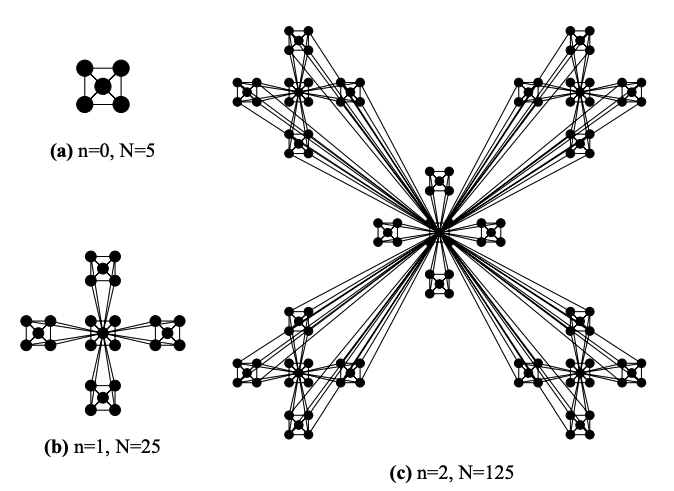
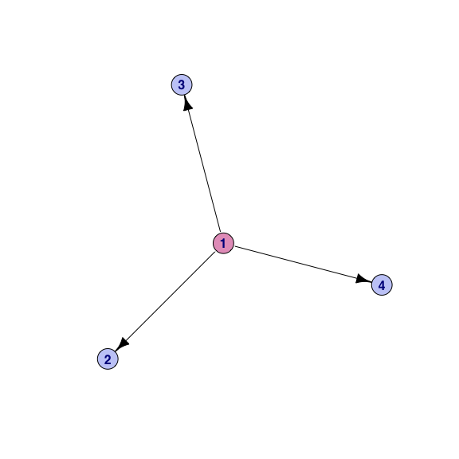
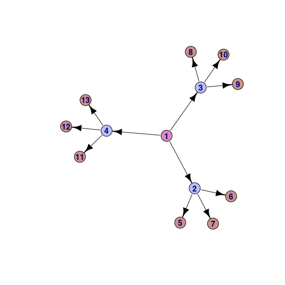
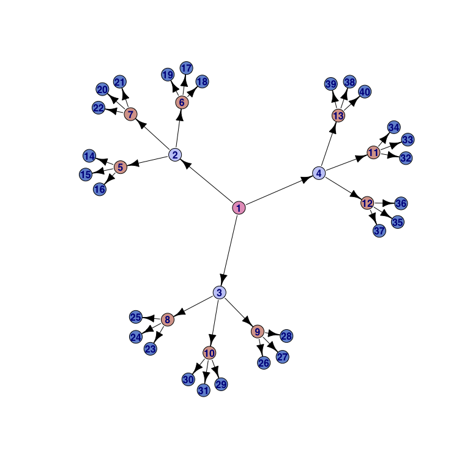
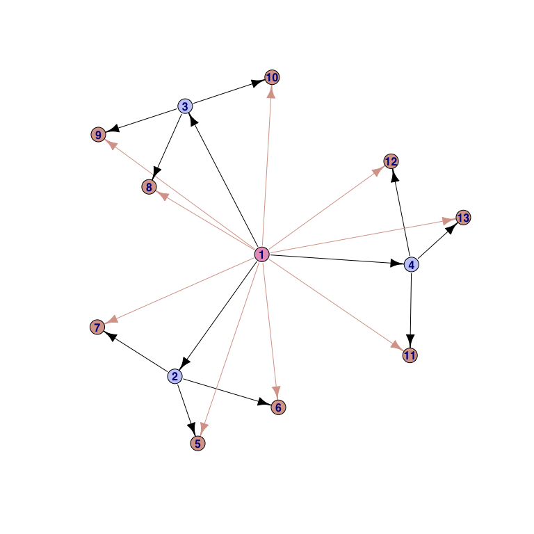
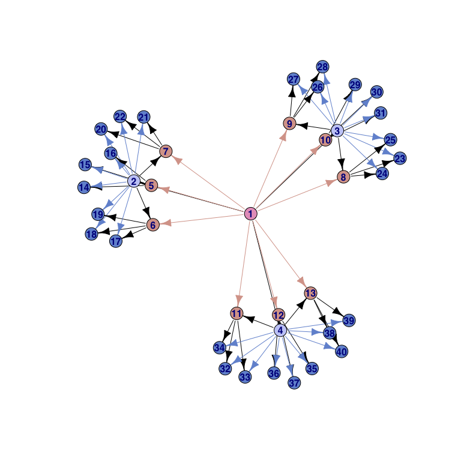
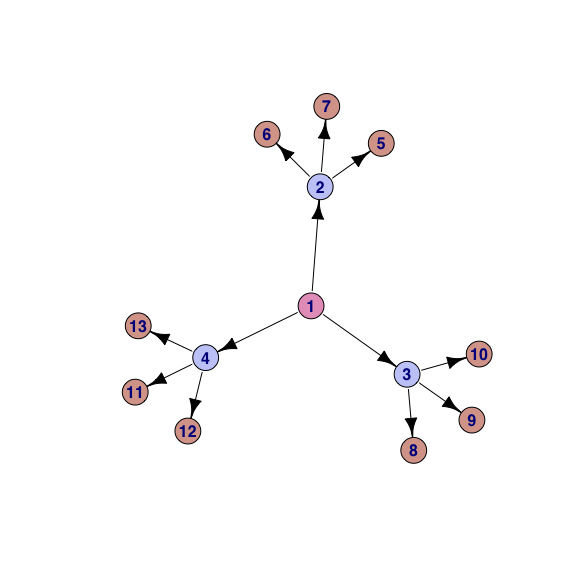
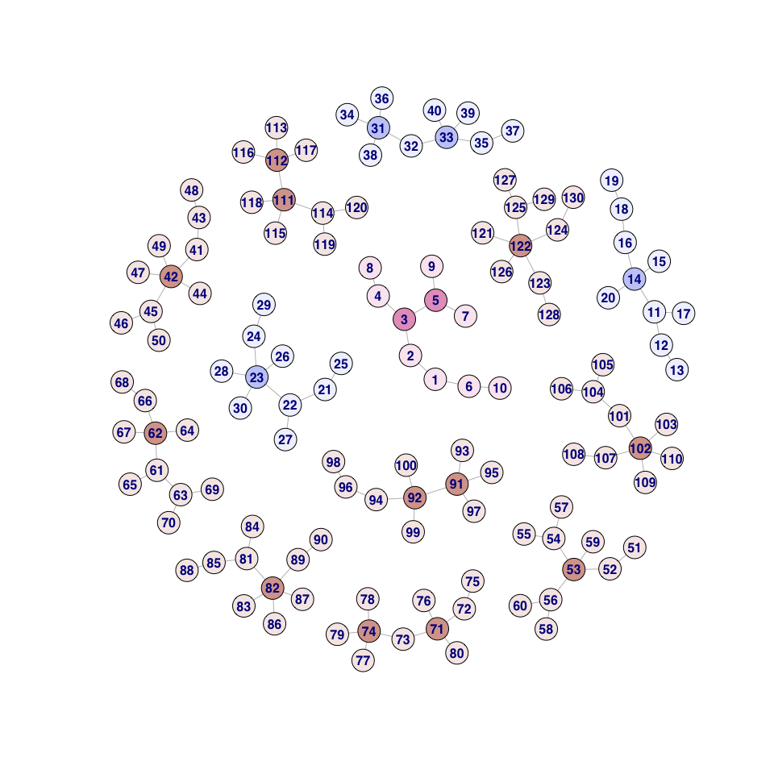
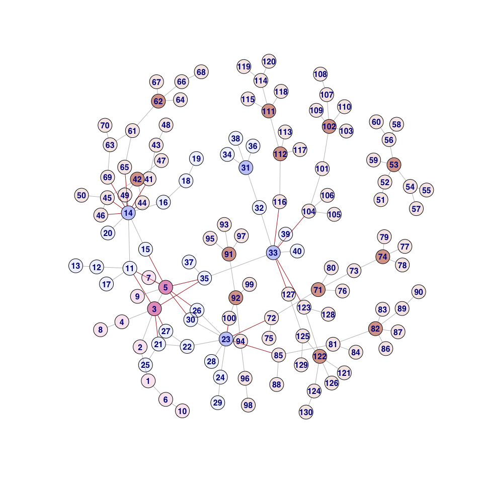
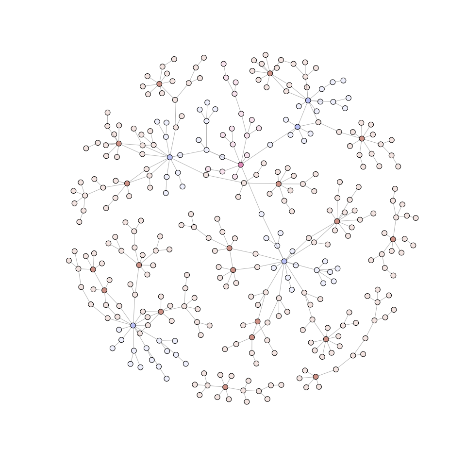

# Hierarchical Modularity

The hierarchical organization of modular scale-free networks

### Background

It’s been well established that biological regulatory networks exhibit
scale-free properties. A relevant model for biological networks utilizes
the Barabási–Albert model for generating random scale-free networks
using a preferential attachment mechanism. It incorporates two important
general concepts: growth and preferential attachment. Both growth and
preferential attachment exist widely in real networks.

  - Growth means that the number of nodes in the network increases over
    time.  
  - Preferential attachment means that the more connected a node is, the
    more likely it is to receive new links.

Additionally, the modularity in biological systems always exhibits the
property of hierarchical organization in which many small, highly
connected modules combine in a hierarchical manner into larger module.
This gives rise to a fractal pattern and self-similar properties are
empirically observed in many biological networks, such as
protein–protein interaction networks.

  - Ravasz E *et. al.* (2002) **Science** Hierarchical organization of
    modularity in metabolic networks.
  - Ravasz E *et. al.* (2003) **Phys Rev E Stat Nonlin Soft Matter
    Phys** Hierarchical organization in complex networks.

Here I walk through the ideas presented in the these papers to
conceptualize some of these organizing principles of biological
networks.

### Schematic



> We start by constructing a hierarchical network model, that combines
> the scalefree property with a high degree of clustering. Our starting
> point is a small cluster of five densely linked nodes (Fig.3a). Next
> we generate four replicas of this hypothetical module and connect the
> four external nodes of the replicated clusters to the central node of
> the old cluster, obtaining a large 25-node module (Fig.3b).
> Subsequently, we again generate four replicas of this 25-node module,
> and connect the 16 peripheral nodes to the central node of the old
> module (Fig.3c), obtaining a new module of 125 nodes. These
> replication and connection steps can be repeated indefinitely, in each
> step increasing the number of nodes in the system by a factor five.

### Implementation

You’ll notice a few things about the model:

  - It’s a hierarchy of modules  
  - We can consider each module to be it’s own scale-free network with
    hubs and targets  
  - Modular hubs can interact with the targets of other hubs

Taking these principles, it makes sene to first create a hierarchical
scaffold where each node will represent a module. The modules of the
scaffold can then be replaced with modular scale-free networks. The
result will be multiple modular scale-free networks within a
hierarchical structure.

#### Creating a hierarchical scaffold

I’m going to use the code explain how it works, keep scrolling…

``` r
library(R6)
library(igraph)
library(wesanderson)

ig.h <- function(levels=1, clusters=3, flat=TRUE) {

    ig <- igraph::make_empty_graph(directed=TRUE) + vertices(1, id=1, level=1)
    parents <- V(ig)$id
    for (level in seq_len(levels-1)) {
        for (parent in parents) {
            # Next node
            nn <- max(V(ig)$id)+1
            # New children
            children <- seq(nn, nn+clusters-1)
            ig <- ig + 
                igraph::vertices(children, id=children, level=level+1) +
                igraph::edges(mapply(list, parent, children, SIMPLIFY=T), color="black")
        }
        # Children become parents
        parents <- ig.children(ig, parents)
    }
    
    # Color by level
    pal <- c(wes_palette("GrandBudapest2"), wes_palette("GrandBudapest1"))
    V(ig)$color <- pal[V(ig)$level]
    
    # Unflatten
    if (!flat) {
        # Grab nodes on outer-most level
        children <- pvector$new(V(ig)$id[V(ig)$level == max(V(ig)$level)])
        parents <- pvector$new()
        # Recursively connect children back to grandparents
        while (children$length() > 0) {
            # Current child
            child <- children$pop()
            # Get parent
            parent <- ig.parents(ig, child)
            if (length(parent) == 0) next
            # Get grandparent
            grandparent <- ig.parents(ig, parent)
            if (length(grandparent) == 0) next
            # Add edge from grandparent to children
            ig <- ig + igraph::edges(c(grandparent, child), color=V(ig)$color[V(ig)$id == child])
            if (parent %in% parents$values) next
            # The parent becomes the child
            children$push(parent)    
            parents$push(parent)
        }
    }

    return(ig)
}
```

#### A flat hierarchy

We start with a single seed module `1` and for each additional level, we
add 3 clusters or modules `2`, `3`, and `4`. Again, the idea is that
each node in the scaffold, or module, will become its own scale-free
network. And edges between modules in the scaffold represent possible
interactions between hubs and targets across scale-free modules in the
final network.

``` r
scaffold <- ig.h(levels=2, clusters=3)
plot(scaffold, vertex.size=15, vertex.label.font=2, vertex.label.family="Helvetica")
```



We can add more levels as well as more clusters infinitely, however each
node in the scaffold can be interpreted as a module that carries out
some biological process, so it would make sense if it was relatively
modest in size.

``` r
scaffold <- ig.h(levels=3, clusters=3)
plot(scaffold, vertex.size=13, vertex.label.font=2, vertex.label.family="Helvetica")
```



``` r
scaffold <- ig.h(levels=4, clusters=3)
plot(scaffold, vertex.size=8, vertex.label.font=2, vertex.label.family="Helvetica")
```



Additionally, we don’t need to enforce a flat structure, we can also
allow interactions between across muliple levels. With this option, we
allow the interaction between a module and an additional lower level.
For example, module `1` can only interact with modules on level 2 or 3,
not 4. While module `2` can interact with modules on level 3 and 4.

``` r
scaffold <- ig.h(levels=3, clusters=3, flat=FALSE)
plot(scaffold, vertex.size=8, vertex.label.font=2, vertex.label.family="Helvetica")
```



``` r
scaffold <- ig.h(levels=4, clusters=3, flat=FALSE)
plot(scaffold, vertex.size=8, vertex.label.font=2, vertex.label.family="Helvetica")
```



#### Creating scale-free modules within the scaffold

We’ll stick with a hierarchy to explanatory purposes. Here we have a
hierarchy of modules:

  - Nodes in module `1` can interact with any of the nodes in modules
    `2`,`3`,`4`  
  - Nodes in module `2` can interact with any of the nodes in modules
    `5`,`6`,`7`  
  - Nodes in module `3` can interact with any of the nodes in modules
    `8`,`9`,`10`  
  - Nodes in module `4` can interact with any of the nodes in modules
    `11`,`12`,`13`

This allows us to generate a scale free network within a hierarchical
and modular framework.

``` r
scaffold <- ig.h(levels=3, clusters=3)
plot(scaffold, vertex.size=15, vertex.label.font=2, vertex.label.family="Helvetica")
```



Here we will replace each module with a scale-free network of `n=10`
genes with a preferential attachment `power=1.7` using the
Barabasi-Albert model for preferential attachment. Here we follow the
same idea, where modular hubs randomly interact with the targets of
other hubs, which is a phenomenon found in biology.

Nodes are colored by the original modules they belong too but to keep
track of hubs, we shade them darker.

``` r
# Replace modules with scale-free graphs
modules <- V(scaffold)$id
head(modules)
```

    [1] 1 2 3 4 5 6

``` r
# Here we follow the same idea, where modular hubs randomly interact with the targets of other hubs.
graphs <- lapply(modules, function(m) {
    g.m <- igraph::sample_pa(directed=FALSE, n=10, power=1.7)
    V(g.m)$module <- m
    V(g.m)$color <- unique(V(scaffold)$color[V(scaffold)$id == m])
    V(g.m)$hub <- degree(g.m) == max(degree(g.m))
    E(g.m)$color <- "grey"
    return(g.m)
})
ig <- Reduce("+", graphs)
```

``` r
V(ig)$color[!V(ig)$hub] <- adjustcolor(V(ig)$color[!V(ig)$hub], 0.25)
plot(ig, vertex.size=8, vertex.label.font=2, vertex.label.family="Helvetica")
```



Now we have the modules, but they’re disconnected and we lost the
hierarchy. This is where the scaffold edges come in handy. Because we
kept track of which modules can crosstalk, we can randomly add `m=10`
edges from modular hubs to targets of other modular hubs while
respecting the hierarchical structure of the overall network.

``` r
m <- 25
module.links <- igraph::ends(scaffold, sample(E(scaffold), m, replace=TRUE))
head(module.links)
```

``` 
     [,1] [,2]
[1,]    1    3
[2,]    2    5
[3,]    1    3
[4,]    2    5
[5,]    4   13
[6,]    1    3
```

``` r
# Connect modules
for (i in seq_len(nrow(module.links))) {
    module.parent <- module.links[i,1]
    module.child <- module.links[i,2]
    
    node.parent <- v.sample(ig, V(ig)$module == module.parent & V(ig)$hub)
    node.child <- v.sample(ig, V(ig)$module == module.child & !V(ig)$hub)
    
    # Prevents duplicate edges only
    if (length(E(ig)[from(node.parent) & to(node.child)]) == 0) {
        ig <- ig + igraph::edges(c(node.parent), node.child, directed=FALSE, color="firebrick")   
    }
}
```

``` r
plot(ig, vertex.size=8, vertex.label.font=2, vertex.label.family="Helvetica")
```



#### An example network

  - `levels=3`  
  - `clusters=3`
  - `n=10`
  - `m=100`
  - `power=1.5`

<!-- end list -->

    IGRAPH d2f215a U--- 336 347 -- Barabasi graph
    + attr: name_1 (g/c), name_2 (g/c), power_1 (g/n), power_2 (g/n), m_1
    | (g/n), m_2 (g/n), zero.appeal_1 (g/n), zero.appeal_2 (g/n),
    | algorithm_1 (g/c), algorithm_2 (g/c), name (g/c), power (g/n), m
    | (g/n), zero.appeal (g/n), algorithm (g/c), module (v/n), color (v/c),
    | hub (v/l), color (e/c), directed (e/l)
    + edges from d2f215a:
     [1]  1-- 2  1-- 3  2-- 4  2-- 5  1-- 6  6-- 7  7-- 8  1-- 9  7--10  4--11
    [11]  5--12  5--13  2--14  8--15  2--16 17--18 17--19 19--20 20--21 17--22
    [21] 19--23 17--24 20--25 19--26 23--27 17--28 19--29 19--30 17--31 19--32
    [31] 33--34 34--35 33--36 33--37 33--38 37--39 38--40 35--41 37--42 40--43
    + ... omitted several edges


